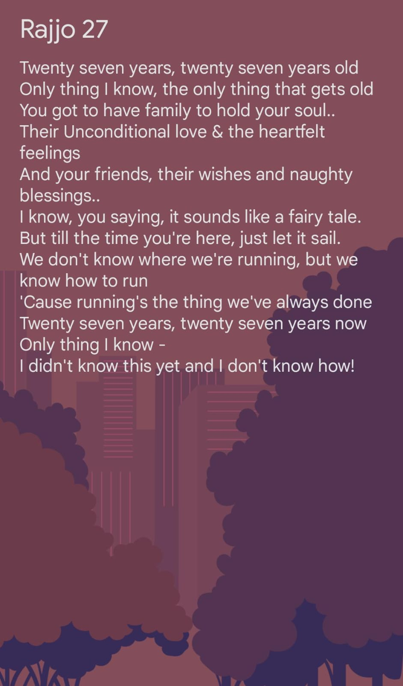
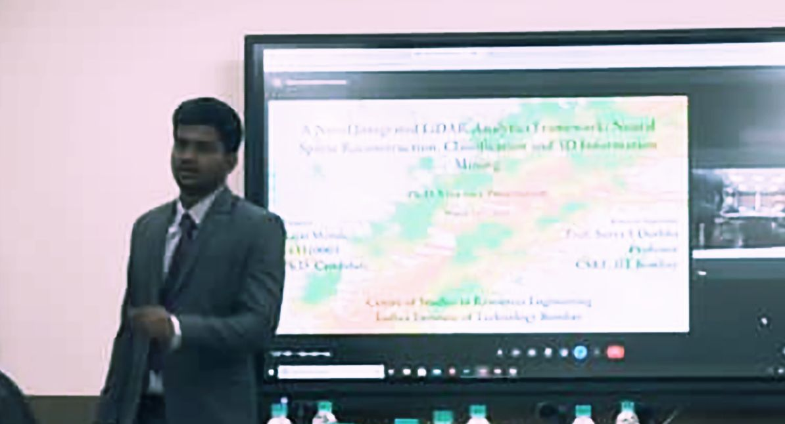
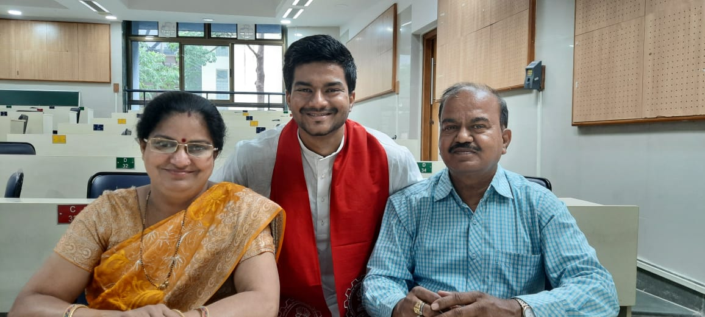
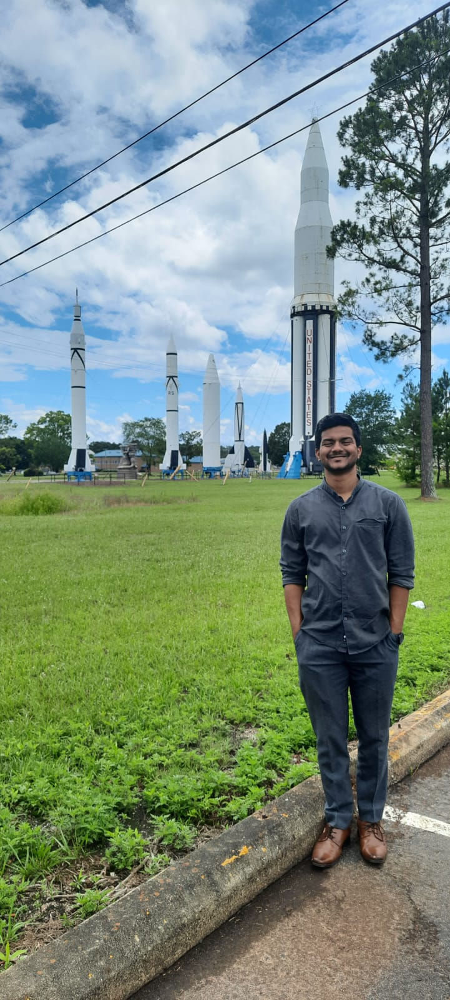
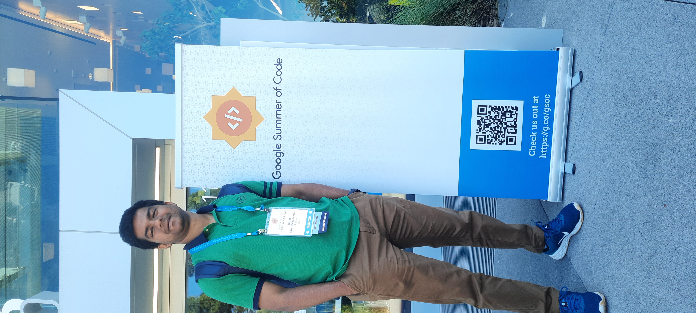
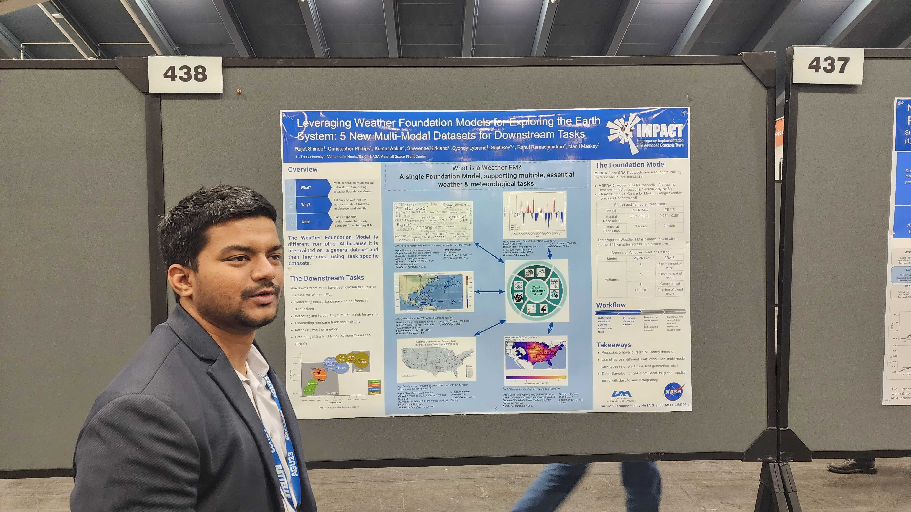

# Wrapping-up 2023

Hi there! This is my attempt to restart compiling my thoughts online and a new year is a perfect milestone for this. Wishing the reader a very happy new year 2024!

The year 2023 was a special year in many aspects. In 2023, I turned 27 and for me the number 27 for age holds a unique place for the song 27 by [Passenger](https://www.youtube.com/watch?v=l4WKh5UqtXc&pp=ygUMMjcgcGFzc2VuZ2Vy). Based on this, I wrote my own short version of 27 when I turned 27 this year:

A big reason for 2023 to be a special year is because I defended my Ph.D. in April and started working for NASA IMPACT - UAH. I have highlighted some details about this milestone in my LinkedIn post [here](https://www.linkedin.com/posts/rajat-shinde_phd-vivavoce-lidar-activity-7042193813716578304-yNQT?utm_source=share&utm_medium=member_desktop). The most common question which I came across post adding the salutation of **Dr.** in front is - How does it feel to defend your Ph.D.? And the most common answer I have and I have heard from most of the people is - nothing new! After it sinks in you and you accept it, it kind of makes you feel more responsible for your words and technical knowhow. For the reason that now you can be unsure but you can't be incorrect. From a mindset during your Ph.D. of being ready to finish a paper in a couple of sleepless nights for your so-thought revolutionary idea, you understand that finishing papers isn't the ultimate objective. Progressing science is! I know it might sound big but gradually my confidence is getting stronger each passing day that we are all part of a bigger system with different cogs and the task of each cog in that system is equally important - irrespective of where the cog is placed. 

### Ph.D. Defense and convocation

I am highly indebted to many individuals including my research supervisor - Prof. Surya Durbha. However, a couple of pair of eyes in this world were sparkling more than anything else. My parents who joined me in IIT Bombay for my Ph.D. convocation had been supremely happy and proud of this. I believe each individual lives their life in three phases - (1) The life they want to live during their childhood (2) The life they actually live, I know adulthood hits differently :wink: (3) The life which they mould for their kids. Apart from Mumma and Papa, my elder brother - Rhishabh, Bhabhi - Sumedha and our cute little champ - Ojasvit (who was just 6 months old at the day of convocation) along with some love(ly) friends were on cloud 9 for this feat. I am grateful to have all of them in my life and I am forever thankful to them for their support. 

### Migration to the U.S.

Next big step was my movement to the U.S. Since the childhood I have been hearing stories about the oldest democracy and the land of opportunities but never I imagined that my first job in my lifetime would be in the U.S. in Huntsville. This transistion has been mammothly challenging but as they say change is the only constant and you have to accept it with open hands. For anyone who's going to migrate abroad for work, I would say that always remember to go slow on yourself, give yourself sometime to blend in physically, social and culturally. And most importantly make friends around you as birds in a flock fly together (I am fortunate to have such a group of birds here in HSV). The journey so far has been remarkable here and I am thankful to Dr. Ramachandran and Prof. Sundar Christopher for providing this opportunity to me. NASA IMPACT team is a diverse and unique set of folks who like their work and are good at it. With some efforts and learnings, I am sure it's easy to get comfortable here find your Ikigai. 

### GSoC Mentor Summit 2023 & AGU 2023

Apart from this, meeting some of the friends in the U.S. has been a great relief to homesickness. Also, representing the OSGeo Foundation in the Google Summer of Code 2023 Mentor Summit has been a great feeling. Equally special was to visit Silicon Valley for the first time and drive across the California One. The year ending with the AGU 2023 was another unique experience. For those who don't know, American Geophysical Union is grand... it is grand in every aspect. Personally, AGU gave me opportunity to meet some great and distinguished researchers and interact with them. Also, present our work and talk to them. 

 Me at Google MP3 office

 Me presenting at the AGU 2023

### OSGeo and OGC Geo-Huntsville
Working with the OSGeo Board has been always enthrilling. A community with around 30,000 members is a big family and being a representative of such a family bears responsibility. With 2023 marking as an end to my first tenure, I am happy to be nominated again along with some legendary contributors. Let's see how it goes with the election process. Being in Huntsville gave me a good opportunity to attend the OGC Member meeting in Huntsville - OGC Geo-Huntsville. With the MoU signed between OSGeo and OGC, OSGeo Charter Members can now attend the OGC Member meetings and participate in DWGs/SWGs. The members need to inform the OSGeo Standards Comittee and I used this opportunity to attend the OGC Geo-Huntsville. 

Now, since I have started writing again, I would try to write a report on AGU 2023 compiling my notes from the conference. Additionally, our group's work was also presented (by Dr. Sujit Roy) during the ECMWF Workshop in Italy.

### Goals for 2024
* Focus on health... squeeze that tummy :sob:
* Complete high-quality and impactful (atleast 5) journal papers on the ideas I have been working on
* Be more disciplined; work on communication skills
* Learn and polish technical skills 
    * FMs, Neural Operators, LLMs, Data centric AI, Biomass analysis, Carbon monitoring and prediction, Quantum Machine learning, Geometric Algebra and Graph Processing
* Plan finances and personal goals for 5 year plan
* Plan a trip with family

Till the next time - Seize your moment! :grin:

